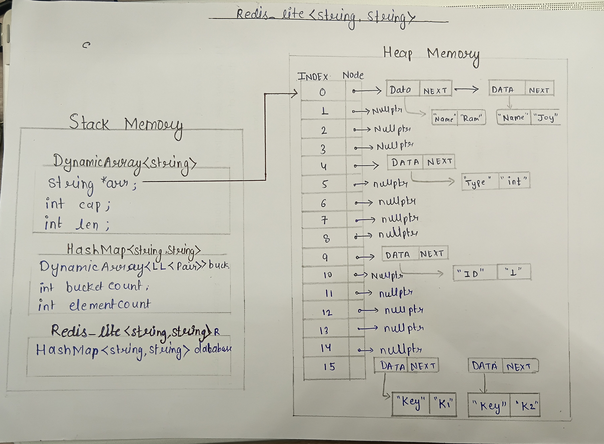

# Redis-Lite Design Proposal 

## Overview

**Redis-Lite** is a lightweight in-memory key-value database implemented in C++. It provides a command-line interface (CLI) that allows users to perform basic database operations such as `SET`, `GET`, `EXISTS`, `DEL`, `CLEAR`, `SIZE`, and `EXIT`.

The database internally uses a custom **HashMap** as its storage engine, enabling efficient average-case insertion, deletion, and lookup operations.

---

# Section 1 - Public API

The APIs are designed to expose simple Redis-like commands while delegating all data storage operations to the underlying `HashMap`.

## Redis_lite

```cpp
template<typename K, typename V>
class Redis_lite {

private:
    HashMap<K, V> database;

    std::string To_lower(std::string s);

public:
    Redis_lite();

    void run();

    bool set(const K& key, const V& value);
    bool get(const K& key);
    bool exists(const K& key);
    bool del(const K& key);
    bool clear();

    size_t size() const;
};
```

**Templates** are used to make the database generic so that different key and value types can be stored without modifying the implementation. This provides compile-time type safety and code reusability.

---

# Section 2 - Internal Representation

Redis-Lite stores all key-value pairs inside a custom **HashMap** object named `database`.

The application acts as a command interpreter. It continuously accepts user commands from the console, parses them using `stringstream`, converts the command name to lowercase for case-insensitive matching, and invokes the corresponding database operation.

The actual storage, collision handling, hashing, and memory management are delegated to the underlying `HashMap`.

## Memory Management

Redis-Lite does **not** allocate any dynamic memory directly.

The internal `HashMap` owns all dynamically allocated memory through the custom `DynamicArray` and `LinkedList` implementations.

When a `Redis_lite` object is destroyed, its `HashMap` destructor is automatically invoked, which releases every bucket and all linked-list nodes, ensuring there are no memory leaks.

## Memory Diagram




---

# Section 3 - Complexity Estimates

| Operation | Best Case | Average Case | Worst Case | Reason |
|-----------|:---------:|:------------:|:----------:|--------|
| `Redis_lite()` | O(1) | O(1) | O(1) | Constructs an empty HashMap. |
| `run()` | O(1) | Depends on commands | Depends on commands | Continuously processes user commands. Complexity depends on the invoked database operation. |
| `set()` | O(1) | O(1) | O(n) | Delegates insertion to HashMap. Worst case occurs during excessive collisions or rehashing. |
| `get()` | O(1) | O(1) | O(n) | Delegates lookup to HashMap. Worst case occurs when all keys hash to the same bucket. |
| `exists()` | O(1) | O(1) | O(n) | Uses HashMap lookup. |
| `del()` | O(1) | O(1) | O(n) | Removes an element from the corresponding bucket. |
| `clear()` | O(n) | O(n) | O(n) | Deletes every stored key-value pair by clearing the HashMap. |
| `size()` | O(1) | O(1) | O(1) | Returns the number of stored key-value pairs maintained by the HashMap. |
| `To_lower()` | O(m) | O(m) | O(m) | Converts each character of the command to lowercase, where **m** is the command length. |

---

# Section 4 - Design Decisions

- Implemented as a **template class** to support different key and value types.

- Uses a custom **HashMap** as the storage engine instead of STL containers.

- Provides a **command-line interface (CLI)** similar to Redis for easy interaction.

- Supports **case-insensitive commands** by converting user input to lowercase before processing.

- Uses **stringstream** to efficiently parse user commands and their arguments.

- Delegates all storage operations (`SET`, `GET`, `DEL`, `EXISTS`, `CLEAR`, and `SIZE`) to the underlying `HashMap`, keeping the implementation modular and maintainable.

- Follows **composition** by embedding a `HashMap` object rather than inheriting from it, resulting in better encapsulation and separation of responsibilities.

- Relies on the `HashMap` implementation for memory management, collision handling, and automatic cleanup, making the Redis-Lite layer lightweight and focused solely on command processing.