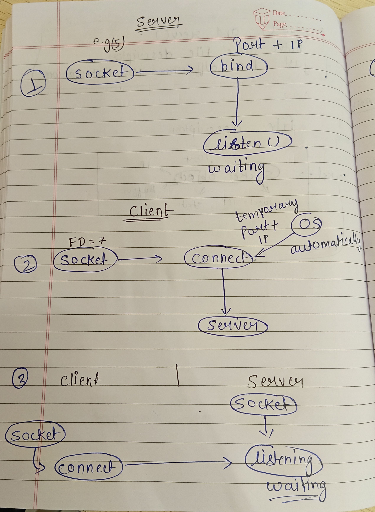
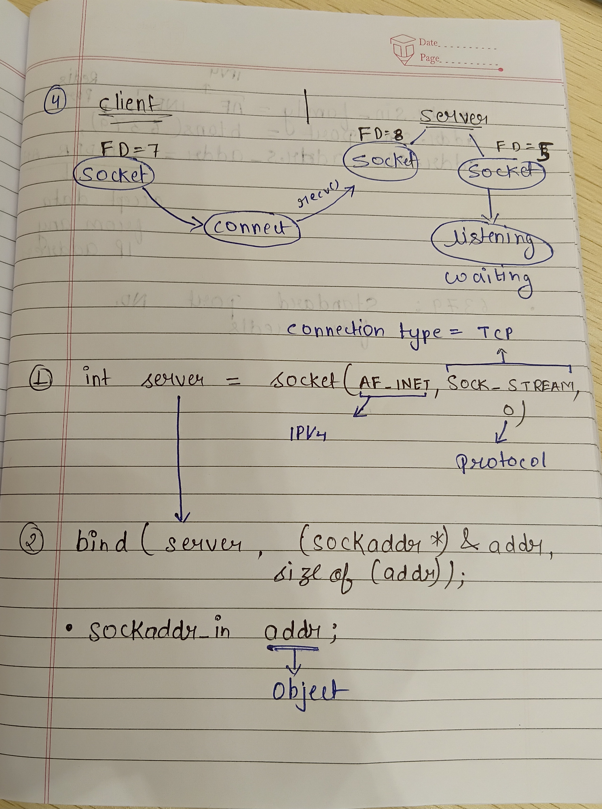
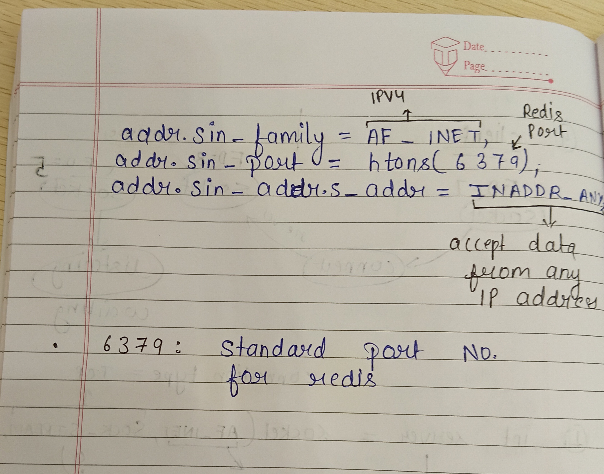

# Build Log - 2026-06-26 (Session 1)
## <div style="display:flex; justify-content:space-between;"> <span style="color:forestgreen;">Duration - 2:00pm to 6:00 pm</span><span>git commit -m <span style="color:forestgreen;font-size:17px;"> "redis-lite cli to Network server design" </span> </span> </div>


# Redis Lite - CLI to Network Server Design (Research & Planning)

## Objective

To understand how a CLI-based Redis implementation can be transformed into a real client-server application similar to the original Redis server.

The focus was not on implementation, but on studying the complete networking architecture and preparing a clean software design before writing any networking code.

---

# Understanding the Difference Between CLI and Redis Server

Initially, the Redis Lite project worked as a command-line application where commands were directly read from the terminal using `getline()`.

Current flow:

```text
User
   │
Keyboard Input
   │
getline()
   │
Command Parser
   │
HashMap
   │
Console Output
```

After studying Redis architecture, it became clear that a real Redis server does not interact directly with the keyboard. Instead, it continuously waits for incoming client requests over a TCP socket.

Target architecture:

```text
Client
   │
TCP Socket
   │
Redis Server
   │
Command Parser
   │
HashMap
   │
Response
```

---

# Software Architecture Improvements

Studied how to redesign the project so that the Redis engine remains independent of the communication interface.

The command execution logic will be separated into a reusable function:

```cpp
std::string execute(const std::string& command);
```

This allows the same Redis engine to work with:

* Command Line Interface (CLI)
* TCP Clients
* Future Redis Protocol (RESP)

without modifying the database logic.

---

# Networking Fundamentals Studied

Studied the complete lifecycle of a TCP server.

Networking workflow:

```text
socket()

↓

bind()

↓

listen()

↓

accept()

↓

recv()

↓

execute()

↓

send()
```

Understanding each stage:

* **socket()** – Creates a TCP communication endpoint.
* **bind()** – Associates the socket with an IP address and port.
* **listen()** – Places the socket into listening mode.
* **accept()** – Accepts incoming client connections and creates a new communication socket.
* **recv()** – Receives commands sent by clients.
* **execute()** – Processes Redis commands using the existing HashMap.
* **send()** – Sends the execution result back to the client.

---

# Networking Concepts Learned

During the design phase, several core networking concepts were studied:

* Difference between Client and Server
* Purpose of TCP sockets
* IP Address and Port
* Role of `bind()`
* Listening sockets vs Connected sockets
* File Descriptors and how the operating system manages sockets
* Process File Descriptor Table
* Multiple client handling using separate connected sockets
* Loopback Interface (`127.0.0.1`)
* `INADDR_ANY`
* Network Byte Order (Big Endian)
* `htons()`, `htonl()`, `ntohs()`, `ntohl()`

---

# Planned Server Flow

The Redis server will eventually follow this execution flow:

```text
Start Server
      │
Create Socket
      │
Bind IP & Port
      │
Start Listening
      │
Accept Client
      │
Receive Command
      │
Execute Redis Command
      │
Send Response
      │
Wait For Next Command
```

---



# Planned Class Structure

The current CLI implementation will be refactored into a cleaner server architecture.

Major responsibilities identified:

* Server startup
* Socket creation
* Client connection handling
* Command execution
* Response transmission
* Database operations

This separation will make the Redis engine reusable across multiple communication interfaces.

---

# Major Learnings

* Difference between a CLI application and a TCP server.
* Internal lifecycle of a TCP socket.
* How operating systems manage sockets using File Descriptors.
* Difference between Ports and Sockets.
* How multiple clients communicate with the same server.
* Why networking uses Big Endian (Network Byte Order).
* Importance of separating business logic from the communication layer.

---

# Current Progress

The CLI-based Redis engine is functionally complete for basic database operations.

The architectural planning required to convert Redis Lite into a network-based server has also been completed.

A simple server structure and development roadmap are now ready for the next implementation session.

The next development phase will focus on implementing the networking layer using TCP sockets while keeping the existing Redis engine unchanged.
