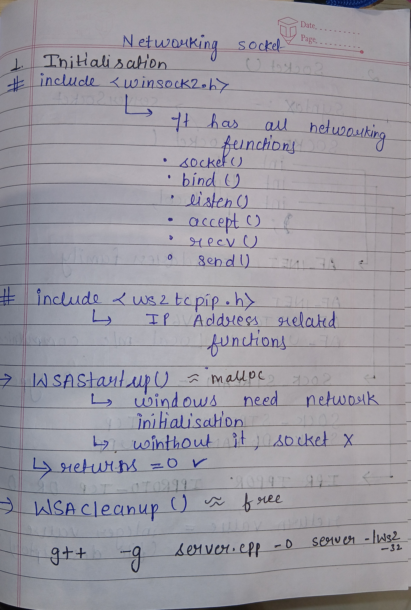
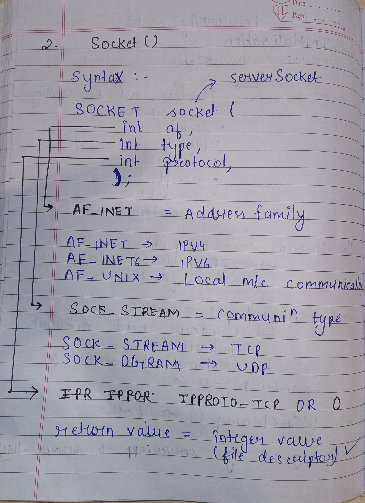
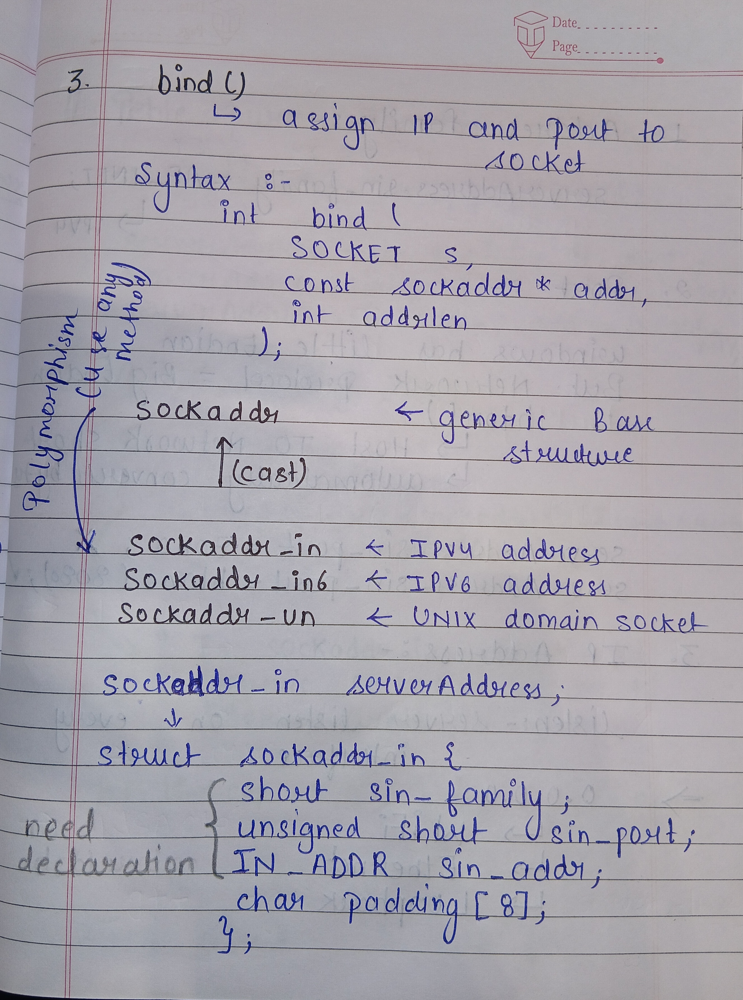
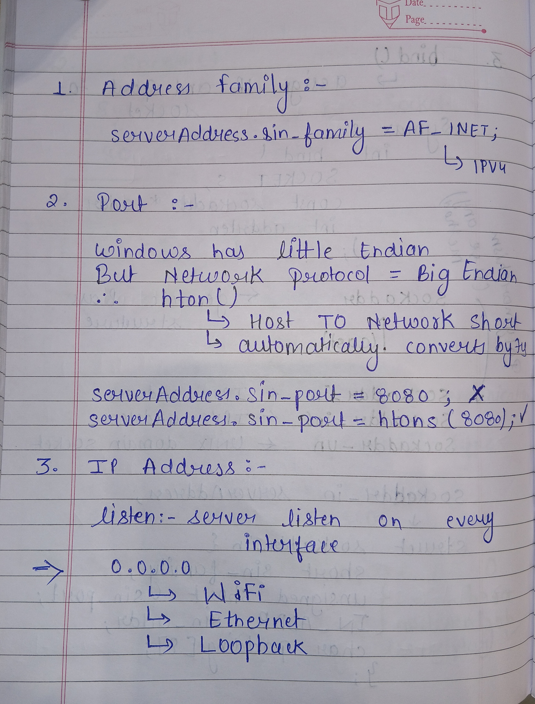
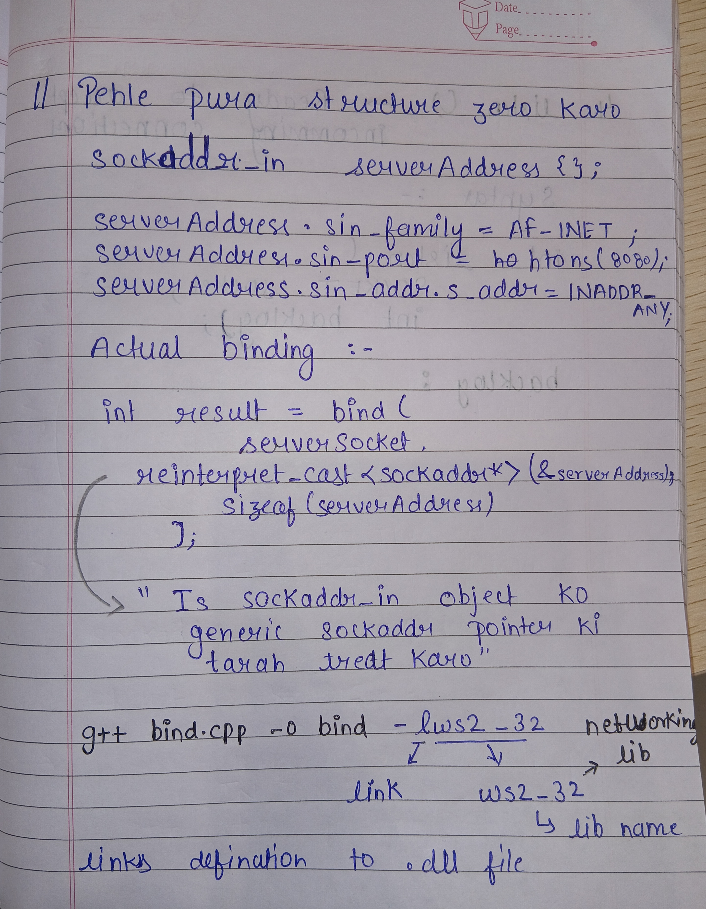
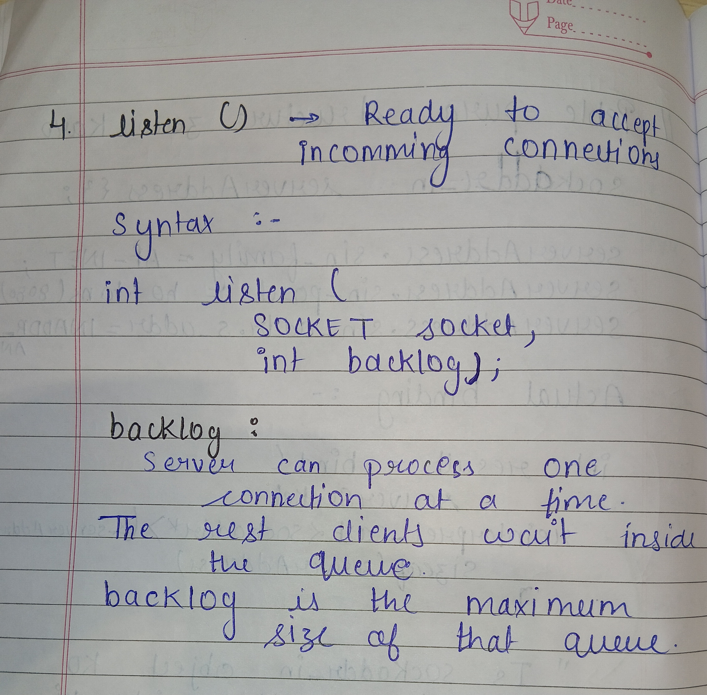

# Build Log - 2026-06-29 (Session 1)

## <div style="display:flex; justify-content:space-between;"> <span style="color:forestgreen;">Duration - 9:00am to 1:00 pm</span><span>git commit -m <span style="color:forestgreen;font-size:17px;"> "understood networking & implemented basic network server" </span> </span> </div>


## Objective - Learning

Today's objective was to begin learning socket programming from scratch before implementing the Redis Lite server. Instead of directly building the Redis server, the focus was on understanding the networking APIs that form the foundation of TCP servers.

---

# Topics Covered

## 1. Introduction to Socket Programming

Learned what a socket is and why it is required for communication between two machines over a network.

Understood that a socket acts as a communication endpoint, similar to how a file descriptor represents an opened file.

Studied the complete TCP server workflow:

```
WSAStartup()
    ↓
socket()
    ↓
bind()
    ↓
listen()
    ↓
accept()
    ↓
recv()
    ↓
send()
```

This workflow is commonly used by backend servers such as Redis, MySQL, PostgreSQL, HTTP servers, and chat applications.

---

## 2. Winsock Initialization

Implemented:

```cpp
WSADATA wsData;

WSAStartup(MAKEWORD(2,2), &wsData);
```

Learned:

* Windows requires the networking subsystem to be initialized before any socket API can be used.
* `MAKEWORD(2,2)` requests Winsock version 2.2.
* `WSACleanup()` must be called before the application exits to properly release networking resources.


---

## 3. Creating a TCP Socket

Implemented:

```cpp
SOCKET serverSocket = socket(
    AF_INET,
    SOCK_STREAM,
    IPPROTO_TCP
);
```

### Concepts Learned

### AF_INET

Represents the IPv4 address family.

### SOCK_STREAM

Represents TCP communication.

Characteristics:

* Reliable
* Ordered
* Connection-oriented

### IPPROTO_TCP

Explicitly specifies the TCP protocol.

Also learned that:

```
INVALID_SOCKET
```

is returned if socket creation fails.




---

## 4. Binding the Socket

Implemented:

```cpp
sockaddr_in serverAddress{};

serverAddress.sin_family = AF_INET;
serverAddress.sin_port = htons(8080);
serverAddress.sin_addr.s_addr = INADDR_ANY;

bind(...);
```

### Concepts Learned

### sockaddr_in

Used to represent an IPv4 address.

Important fields:

* sin_family
* sin_port
* sin_addr

### htons()

Converts the host byte order into network byte order (Big Endian).

### INADDR_ANY

Allows the server to listen on every available network interface.



---

## 5. Understanding sockaddr vs sockaddr_in

Learned the difference between:

```
sockaddr
```

and

```
sockaddr_in
```

### sockaddr

A generic address structure used by networking APIs.

### sockaddr_in

A specialized structure for IPv4 addresses.

Understood why networking APIs accept a generic pointer:

```cpp
reinterpret_cast<sockaddr*>(&serverAddress)
```

This allows the same API to work with IPv4, IPv6, and other address families.

---

## 6. Starting the Server

Implemented:

```cpp
listen(serverSocket, 5);
```

### Concepts Learned

The `listen()` function does **not** accept clients.

Instead, it:

* Converts the socket into a listening socket.
* Creates a queue for incoming connection requests.

Learned the purpose of the backlog parameter:

```cpp
listen(serverSocket, 5);
```


This specifies the maximum number of pending client connection requests that may wait in the queue.

---

## 7. Overall TCP Server Flow

The implemented server currently performs:

```
Initialize Winsock

↓

Create Socket

↓

Bind Socket

↓

Start Listening
```

This forms the foundation of a TCP server.

---

# Errors Faced

## Error 1

### Undefined Reference

```
undefined reference to __imp_WSAStartup

undefined reference to __imp_WSACleanup
```

### Cause

The compiler successfully found the function declarations in:

```cpp
#include <winsock2.h>
```

However, the linker could not find the actual implementation of these networking functions.

This occurred because the Winsock library was not linked during compilation.

### Resolution

Compiled using:

```bash
g++ -g server.cpp -o server -lws2_32
```

Learned that:

```
-lws2_32
```

links the Windows Winsock library, which contains the implementations of:

* WSAStartup()
* socket()
* bind()
* listen()
* accept()
* recv()
* send()

Also understood the difference between:

* Header files (Declarations)
* Libraries (Implementations)
* Compiler
* Linker

---

## Error 2

### Unexpected Number Printed Before "Bind Successful"

Observed output:

```
296Bind Successful
```

### Cause

An additional variable (socket handle / debug output) was accidentally being printed before the success message.

### Resolution

Removed the unnecessary debug print statement.

Correct output became:

```
Winsock Initialized Successfully

Socket Created Successfully

Bind Successful

Server is Listening...
```

---

## Concepts Understood

* TCP vs UDP
* IPv4 Address Family
* Socket Lifecycle
* Socket Handle
* Winsock Initialization
* Binding a Socket
* Network Byte Order
* Generic vs Specialized Address Structures
* Listening Socket
* Pending Connection Queue
* Header Files vs Libraries
* Compilation vs Linking
* Why `-lws2_32` is required when using MinGW

---

## Current Progress

Successfully implemented a basic TCP server capable of:

* Initializing Winsock
* Creating a TCP socket
* Binding to a specific port
* Entering listening mode

The server is now ready for the next implementation phase:

* `accept()`
* `connect()`
* `send()`
* `recv()`
* Two-way client-server communication
* Multi-client support using threads
* Redis Lite command processing over TCP

---

## Next Session Goals

* Implement `accept()`
* Create a TCP client using `connect()`
* Establish communication between two machines
* Exchange messages using `send()` and `recv()`
* Build a simple console-based chat application as the networking foundation for the Redis Lite server
